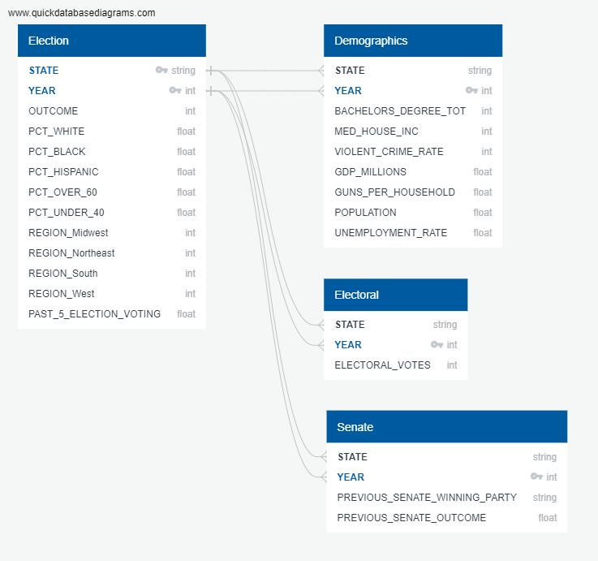

# Predicting Presidential Elections at the State Level

# Project Overview

Throughout history we have seen changes in how different states vote in elections. What makes a state red or blue? Our goal is to determine the answer to this question by using our data sources to see they somehow correlate with the outcome of previous elections. If accurate, we believe that we can utilize our model to predict future elections. 

## Google Slides Presentation
### [Link to Google Slides Presentation](https://docs.google.com/presentation/d/1Fi2ku2yF1nq2R5zSuyaotLsO4VyYtfnHJCpFY3X6e9w/edit?usp=sharing)

## Tableau Dashboard
### [Link to Tableau Dashboard](https://public.tableau.com/profile/tyler.foreman#!/vizhome/ElectionPredictions_16214580151030/Story1)

## Database
- ERD   

## Machine Learning Module

### Scaled the data with MinMaxScaler

### Created training and testing data

### Split training and testing data / Use logistic regression to determine coefficients

### Use logistic regression to predict election outcome

## Results

