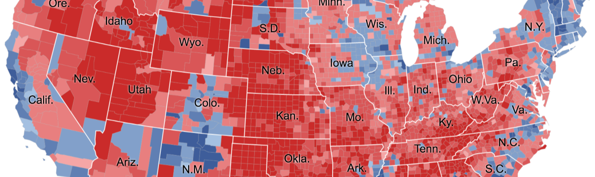

# Predicting Presidential Elections at the State Level

## Machine Learning Module

## Database
- ERD   
## Presentation (Google Slides)
[Link to Google Slides Presentation](https://docs.google.com/presentation/d/1Fi2ku2yF1nq2R5zSuyaotLsO4VyYtfnHJCpFY3X6e9w/edit?usp=sharing)

### Slide 1

### Slide 2

### Slide 3

### Slide 4

### Slide 5

### Slide 6

